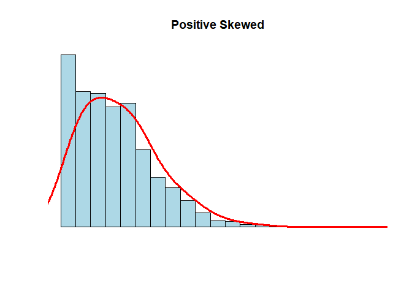

Atividade Avaliativa I
================
Edivan dos Santos do Rosario </br>
Estat 2021.1

*Questão 01*

*(a)* O erro dele é que o mesmo considerou a mala mais pesada sendo a
que representa o valor do quartis superior e a análise que pelo boxplot
existem malas mais pesadas entre esse quartil e o limite superior
(29kg), onde está localizado 25% da amostra. Portanto, 23kg não
representa a mala mais pesada da distribuição.

*(b)* A mediana é representada pelo segundo quartil, assim, o seu valor
é de 17kg

*(c)* A distância interquartílica é a diferença entre o quartil superior
pelo quartil inferior, assim, a distância seria 23 - 10 = 13.

*(d)* A quantidade de malas presente entre 5kg e 10kg está no primeiro
quartil que corresponde a 25% do total da amostra, assim, corresponderia
a 25% de 240 malas, ou seja, 60 malas.

*Questão 2*

A soma de todas as médias dos 30 alunos, multiplicando 30 pela média
aritmética das notas, ou seja, 6.40 encontrando como resultado 192. Da
mesma forma, obtive a soma total das médias dos outros 50 alunos da
outra turma, multiplicando o total de alunos (50) por 5,20 tendo como
total 260. Feito isso, somei a soma total das médias das duas turma (192
+ 260 = 452) e dividi por 80 (total de alunos correspondentes as duas
turmas) (452/80) . Assim, obtive que a média aritmética dos 80 alunos é
(a) 5,65

*Questão 3*

``` r
X  <- c ( 68 , 70 , 72 , 58 , 90 , 110 , 68 , 70 , 72 , 80 , 80 , 67 , 90 , 94 , 100 , 80 , 75 , 79 , 84 , 90 )
```

*(b)* Média = 79,85; Primeiro quartil = 70,0; Mediana = 79,5; Quartil
Terceiro = 90; Desvio padrão = 12.78681 Para encontrar essa resposta,
utilizei os seguintes códigos

``` r
mean ( X )
```

    ## [1] 79.85

``` r
quantile ( X )
```

    ##    0%   25%   50%   75%  100% 
    ##  58.0  70.0  79.5  90.0 110.0

``` r
median ( X )
```

    ## [1] 79.5

``` r
sd ( X )
```

    ## [1] 12.78681

*(c)* No histograma, é possível perceber uma certa assimetria entre os
valores, por isso que a mediana representa a melhor medida central do
conjunto de dados.

*Questão 04* *(a)* Importei o dataset para o Rstudio com o seguinte
código

``` r
frango_dieta <- read_csv("dados/brutos/frango_dieta.csv") 
```

    ## Rows: 578 Columns: 4

    ## -- Column specification --------------------------------------------------------
    ## Delimiter: ","
    ## dbl (4): peso, tempo, frango, dieta

    ## 
    ## i Use `spec()` to retrieve the full column specification for this data.
    ## i Specify the column types or set `show_col_types = FALSE` to quiet this message.

Ao analisar o conjunto de dados foi possível identificar que cada coluna
representa uma variável (peso, tempo, frango, dieta), cada linha
apresentava sobre as variáveis e cada célula apresentava uma única
observação, logo, este dataset está organizado na forma tidy

*(b)* Usando o código

``` r
mean(frango_dieta$peso )
```

    ## [1] 121.8183

Encontrei que a média do peso dos fragos é 121.8183

*(c)* Usando o código

``` r
sd(frango_dieta$peso )
```

    ## [1] 71.07196

Encontrei como desvio padrão o valor 71.07196

*(d)* A variável peso é quantitativa contínua. A variável tempo é
quantitativa discreta A variável é frango qualitativa nominal A variável
dieta é qualitativa nominal

*Questão 5* Rodando o seguinte código

``` r
N <- 1000
x <- rnbinom(N, 4, .5)
hist(
x,
xlim = c(min(x), max(x)),
probability = T,
nclass = max(x) - min(x) + 1,
col = 'lightblue', xlab = ' ', ylab = ' ', axes = F,
main = 'Positive Skewed'
)
lines(density(x, bw = 1), col = 'red', lwd = 3)
```

<!-- -->

Analisando esse gráfico, é possível perceber que a disposição dos
valores é assimétrica, logo, a mediana é a melhor medida central para
representar esses dados.

*Questao 06*

*b)* Não, pois o tidy apresenta

**c**

``` r
dados_co2 %>%                
pivot_longer(
1:13,                
names_to = "ano",    
values_to = "dez")  
```

    ## # A tibble: 507 x 2
    ##    ano     dez
    ##    <chr> <dbl>
    ##  1 ano   1959 
    ##  2 jan    315.
    ##  3 fev    316.
    ##  4 mar    316.
    ##  5 abr    318.
    ##  6 mai    318.
    ##  7 jun    318 
    ##  8 jul    316.
    ##  9 ago    315.
    ## 10 set    314.
    ## # ... with 497 more rows

**d**

``` r
dados_co2 <- read_csv("dados/brutos/dados_co2.csv")
```

    ## Rows: 39 Columns: 13

    ## -- Column specification --------------------------------------------------------
    ## Delimiter: ","
    ## dbl (13): ano, jan, fev, mar, abr, mai, jun, jul, ago, set, out, nov, dez

    ## 
    ## i Use `spec()` to retrieve the full column specification for this data.
    ## i Specify the column types or set `show_col_types = FALSE` to quiet this message.

``` r
dados_co2 %>% View()
```

``` r
dados_co2_tidy <- dados_co2 %>% 
  pivot_longer(
    !ano, 
   names_to = "mes",
   values_to = "ppm"
  )
```

``` r
write_csv(dados_co2_tidy, "dados/tidy/dados_co2_tidy.csv")
```

*e)*Ao passar dos anos a media esta subindo exponencialmente

``` r
co2_tidy <-  read_csv("dados/tidy/dados_co2_tidy.csv")
```

    ## Rows: 468 Columns: 3

    ## -- Column specification --------------------------------------------------------
    ## Delimiter: ","
    ## chr (1): mes
    ## dbl (2): ano, ppm

    ## 
    ## i Use `spec()` to retrieve the full column specification for this data.
    ## i Specify the column types or set `show_col_types = FALSE` to quiet this message.

``` r
View(co2_tidy)

co2_tidy %>% glimpse()
```

    ## Rows: 468
    ## Columns: 3
    ## $ ano <dbl> 1959, 1959, 1959, 1959, 1959, 1959, 1959, 1959, 1959, 1959, 1959, ~
    ## $ mes <chr> "jan", "fev", "mar", "abr", "mai", "jun", "jul", "ago", "set", "ou~
    ## $ ppm <dbl> 315.42, 316.31, 316.50, 317.56, 318.13, 318.00, 316.39, 314.65, 31~

``` r
#-------------------------------------------
co2_tidy %>% # conjunto de dados
group_by(ano) %>% # agrupa por ano
summarise(media = round(mean(ppm), 2)) %>% # calcula a média da variavel ppm em cada grupo
ggplot(aes(ano, media, group = 1)) + # cria o gráfico
geom_line(color = "blue", size = 1)
```

<!-- -->

``` r
#-------------------------------------------
```

**Questão 07** Considere a Tabela 1:

**a**

``` r
tibble(
  nome = c("Ana", "Ludimilla", "Cristina", "Tereza", "Patrícia", "Mariana", "Ana Paula", "Dirce"),
  altura = c("155", "158", "162", "168", "170", "170", "172", "173"),
  peso = c("50", "61", "65", "68", "69", "65", "82", "79")
)
```

    ## # A tibble: 8 x 3
    ##   nome      altura peso 
    ##   <chr>     <chr>  <chr>
    ## 1 Ana       155    50   
    ## 2 Ludimilla 158    61   
    ## 3 Cristina  162    65   
    ## 4 Tereza    168    68   
    ## 5 Patrícia  170    69   
    ## 6 Mariana   170    65   
    ## 7 Ana Paula 172    82   
    ## 8 Dirce     173    79

**b**

peso e altura.

**c**

Peso: Mediana= 66,5 Média= 67,375 Desvio padrão= 9,39

Altura: Mediana= 169 Média = 166 Desvio padrão= 6,34

**d)** Conforme a altura aumenta, o peso tende a aumentar
proporcionalmente.

``` r
plot(tabela_1_4_$"peso", tabela_1_4_$"altura" , col = "blue", xlab = "peso", ylab = "altura", main = "tabela 1")
```

<!-- -->
